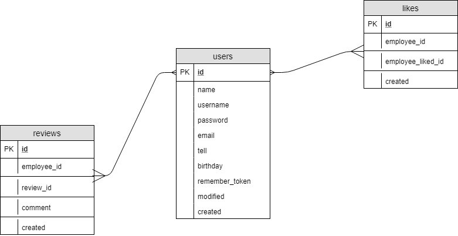

# laravel_employee
same as my SES project, but with the Larvel frame work: 
[https://github.com/sirpauley/SES]

## Setup guide
1. Configure database setting in .env
2. ```php artisan migrate``` migrate database
3. ``` php artisan db:seed ``` Add an ADMIN user to database
 + username: ```admin```
 + Password: ```admin```
4. php artisan serve
5. login and enjoy

## Current database design


## External libraries used
+ bootstrap 4 CND version [https://getbootstrap.com/]
+ Google jQuery library CND
+ Medialoot template [https://medialoot.com/preview/frame/bootstrap-4-dashboard.html]
+ Bootstrap4 DataTable [https://datatables.net/]
+ laravel 5.6

## Functions
+ Employee list/edit/add
+ Statistics of employees
+ phonebook of employees (email/tellephone) search
+ Employee review (like/comment)
+ Password reset by admin users

## Some info
+ password uses laravel HASH
